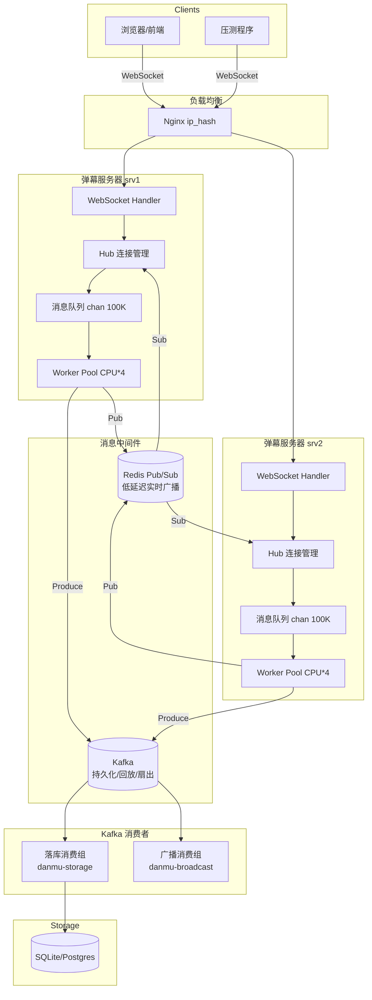

# 百万 QPS 直播弹幕系统

高并发直播弹幕系统，支持多机部署、百万级 WebSocket 长连接、Redis 跨机实时广播、Kafka 持久化与多消费组。

## 架构图



```
数据流：

客户端(浏览器/压测) --WebSocket--> Nginx(LB) --> 弹幕服务器(多台)
                                                    │
                                            ┌───────┼───────┐
                                       本机广播   Kafka    Redis Pub/Sub
                                       (同机连接)  (持久化)  (跨机实时广播)
                                                    │
                                            ┌───────┼───────┐
                                       落库消费组  广播消费组  分析消费组
                                       (SQLite)   (备选广播)  (可扩展)
```

## 各组件职责

| 组件 | 职责 |
|------|------|
| **Nginx** | WebSocket 负载均衡（ip_hash），HTTP 反向代理 |
| **弹幕服务器** | WebSocket 长连接管理、消息队列削峰、worker 池批量广播、限流 |
| **Hub** | 房间-连接映射管理（`map[roomId]map[uid]*Client`，RWMutex 保护） |
| **Worker Pool** | 固定 `CPU*4` goroutine，批量聚合（1000条/10ms）后广播，减少 syscall |
| **Redis Pub/Sub** | 跨机实时广播，频道 `room:{roomId}`，SourceServer 去重 |
| **Kafka Producer** | 异步批量写入 `danmu-history` topic，按 roomId 分区 |
| **落库消费组** | 消费 Kafka 写入 SQLite，支持水平扩容、自动 rebalance |
| **广播消费组** | Kafka 驱动的备选跨机广播方案 |
| **压测程序** | 参数化压测，HDR Histogram 高精度延迟统计 |

## Redis vs Kafka 分工

**Redis Pub/Sub 负责低延迟实时广播**：
- 延迟极低（亚毫秒），适合弹幕这种实时性要求高的场景
- Fire-and-forget 语义，不持久化，不回放
- 适用于：同一条弹幕需要立刻推送给所有在线用户

**Kafka 负责持久化 / 回放 / 多下游消费**：
- 消息持久化到磁盘，支持回放（新用户进房间看历史弹幕）
- 消费组机制支持多个独立下游（落库、分析、审核）各自消费同一份数据
- 支持水平扩容，消费者自动 rebalance
- 适用于：弹幕历史记录、数据分析、敏感词审核等异步场景

**为什么不能只用其中一个**：
- 只用 Redis：没有持久化，服务重启后消息丢失，无法回放历史，无法支撑多下游消费
- 只用 Kafka：延迟较高（批量消费），不适合弹幕实时推送；消费组共享消费，不适合广播语义（每台机器都要收到每条消息）

## 启动步骤

### 1. Docker Compose 一键启动

```bash
# 设置鉴权 token（可选，默认 danmu-secret-token）
export DANMU_AUTH_TOKEN=your-secret-token

# 启动所有服务
docker-compose up -d

# 查看服务状态
docker-compose ps

# 查看日志
docker-compose logs -f danmu-server-1
```

### 2. 手动启动（开发环境）

```bash
# 先启动 Redis 和 Kafka
docker run -d --name redis -p 6379:6379 redis:7-alpine
docker run -d --name kafka -p 9092:9092 \
  -e KAFKA_CFG_NODE_ID=1 \
  -e KAFKA_CFG_PROCESS_ROLES=broker,controller \
  -e KAFKA_CFG_CONTROLLER_QUORUM_VOTERS=1@localhost:9093 \
  -e KAFKA_CFG_LISTENERS=PLAINTEXT://:9092,CONTROLLER://:9093 \
  -e KAFKA_CFG_ADVERTISED_LISTENERS=PLAINTEXT://localhost:9092 \
  -e KAFKA_CFG_LISTENER_SECURITY_PROTOCOL_MAP=PLAINTEXT:PLAINTEXT,CONTROLLER:PLAINTEXT \
  -e KAFKA_CFG_CONTROLLER_LISTENER_NAMES=CONTROLLER \
  bitnami/kafka:3.7

# 编译服务器
cd server && go build -o ../bin/server . && cd ..

# 编译消费者
cd consumer && go build -o ../bin/consumer . && cd ..

# 编译压测程序
cd loadtest && go build -o ../bin/loadtest . && cd ..

# 启动服务器实例 1
DANMU_AUTH_TOKEN=danmu-secret-token ./bin/server \
  -addr=:8081 -id=srv1 -redis=localhost:6379 -kafka=localhost:9092 -mq=both

# 启动服务器实例 2（另一个终端）
DANMU_AUTH_TOKEN=danmu-secret-token ./bin/server \
  -addr=:8082 -id=srv2 -redis=localhost:6379 -kafka=localhost:9092 -mq=both

# 启动落库消费者
./bin/consumer -kafka=localhost:9092 -topic=danmu-history -db=danmu.db -mode=storage
```

### 3. 访问前端

浏览器打开 `http://localhost:8081`（直连）或 `http://localhost:8080`（通过 Nginx）。

## 压测步骤

### 基本压测

```bash
# 1000 连接，10 房间，每连接每秒 1 条弹幕，持续 30 秒
./bin/loadtest \
  --server=ws://localhost:8081,ws://localhost:8082 \
  --conns=1000 \
  --rooms=10 \
  --rate=1 \
  --duration=30s \
  --ramp=5s \
  --token=danmu-secret-token \
  --output-json=report.json \
  --output-csv=report.csv
```

### 分阶段压测剧本

#### 阶段 1：1K 连接（单机验证）

```bash
./bin/loadtest --server=ws://srv1:8081 --conns=1000 --rooms=10 --rate=1 --duration=60s
```

**预期**：延迟 P99 < 10ms，无错误。
**卡住看哪里**：检查服务器日志，`/api/v1/stats` 查看 goroutine 数和内存。

#### 阶段 2：1 万连接

```bash
./bin/loadtest --server=ws://srv1:8081,ws://srv2:8082 --conns=10000 --rooms=50 --rate=0.5 --duration=120s --ramp=20s
```

**预期**：延迟 P99 < 50ms，QPS ~5000。
**卡住看哪里**：
- `ulimit -n` 是否足够（需 > 20000）
- `ss -s` 查看 TCP 连接状态
- 服务器 pprof `:6060/debug/pprof/goroutine`

#### 阶段 3：10 万连接

```bash
# 需要 2 台压测机分担
# 压测机 A
./bin/loadtest --server=ws://srv1:8081,ws://srv2:8082 --conns=50000 --rooms=100 --rate=0.2 --duration=300s --ramp=60s

# 压测机 B
./bin/loadtest --server=ws://srv1:8081,ws://srv2:8082 --conns=50000 --rooms=100 --rate=0.2 --duration=300s --ramp=60s
```

**预期**：延迟 P99 < 100ms，总 QPS ~20000。
**卡住看哪里**：
- fd 限制：`cat /proc/sys/fs/file-max`
- 内存：每连接约 10-30KB，10 万连接约 1-3GB
- GC：`GODEBUG=gctrace=1` 查看 GC 暂停
- 锁竞争：pprof mutex profile
- 网络带宽：`iftop` 或 `nload`

#### 阶段 4：百万连接（多机）

```bash
# 需要 2 台服务器 + 2-4 台压测机
# 每台压测机 25-50 万连接，rate 降低到 0.05-0.1
./bin/loadtest --server=ws://srv1:8081,ws://srv2:8082 --conns=250000 --rooms=500 --rate=0.05 --duration=600s --ramp=120s
```

**预期**：总连接 100 万，广播 QPS 取决于房间分布。
**卡住看哪里**：见下方调优清单。

## 系统调优清单

### 文件描述符

```bash
# 临时设置
ulimit -n 1000000

# 永久设置 /etc/security/limits.conf
* soft nofile 1000000
* hard nofile 1000000

# 系统级
echo 1000000 > /proc/sys/fs/file-max
```
**作用**：每个 TCP 连接占一个 fd，百万连接需要 100 万+。

### TCP 参数

```bash
# 监听队列长度（半连接 + 全连接）
sysctl -w net.core.somaxconn=65535
# 作用：大量并发建连时避免 SYN 被丢弃

sysctl -w net.ipv4.tcp_max_syn_backlog=65535
# 作用：SYN 队列长度，防止爬坡建连时溢出

sysctl -w net.ipv4.tcp_tw_reuse=1
# 作用：TIME_WAIT 端口重用，压测频繁断连重连时避免端口耗尽

sysctl -w net.ipv4.ip_local_port_range="1024 65535"
# 作用：扩大客户端可用端口范围（压测机需要）

sysctl -w net.core.rmem_max=16777216
sysctl -w net.core.wmem_max=16777216
# 作用：增大 TCP 收发缓冲区上限

sysctl -w net.ipv4.tcp_rmem="4096 87380 16777216"
sysctl -w net.ipv4.tcp_wmem="4096 65536 16777216"
# 作用：TCP 自动调优的缓冲区范围
```

### Go 运行时

```bash
# GC 调优：降低 GC 频率（默认 100，改为 400 表示堆增长到 4 倍才触发 GC）
export GOGC=400

# 内存限制（防止 OOM）
export GOMEMLIMIT=4GiB

# GC 追踪（调试用）
export GODEBUG=gctrace=1
```

### 内核参数

```bash
# 网络缓冲区
sysctl -w net.core.netdev_max_backlog=65535

# 避免 conntrack 表满
sysctl -w net.nf_conntrack_max=1000000
# 或直接卸载 conntrack 模块
```

## 常见问题排查

| 问题 | 排查方法 |
|------|----------|
| 建连失败 "too many open files" | `ulimit -n` 和 `fs.file-max` 是否足够 |
| 建连失败 "connection refused" | `somaxconn` 和 `tcp_max_syn_backlog` |
| 压测机端口耗尽 | `ip_local_port_range`、`tcp_tw_reuse`、多 IP 绑定 |
| 延迟飙升 | pprof goroutine/mutex profile，检查锁竞争 |
| 内存持续增长 | pprof heap profile，检查连接泄漏 |
| GC 暂停长 | `GOGC=400`，`sync.Pool` 是否生效 |
| Kafka 写入失败 | 检查 Kafka 连通性，系统自动降级不影响实时广播 |
| Redis Pub/Sub 断开 | 自动重连，检查 Redis maxmemory |
| 消息丢失 | 弹幕系统允许丢消息（设计如此），可靠性由 Kafka 兜底 |

## 公网打通方案

如果在 Colab/无公网 IP 环境部署：

| 方案 | 优缺点 |
|------|--------|
| **frp 自建**（推荐） | 无连接数限制，延迟低，需一台有公网 IP 的机器 |
| **Cloudflare Tunnel** | 免费，支持 WebSocket，但有带宽限制 |
| **ngrok** | 快速验证用，免费版限 40 连接/分钟，**不适合压测** |

推荐使用 frp：

```bash
# frps（公网机器）
[common]
bind_port = 7000

# frpc（内网机器）
[common]
server_addr = your-public-ip
server_port = 7000

[danmu-ws]
type = tcp
local_port = 8080
remote_port = 8080
```

## 目录结构

```
danmu/
├── server/              # 弹幕服务器
│   ├── main.go          # 入口、信号处理、优雅退出
│   ├── hub.go           # 连接与房间管理（RWMutex）
│   ├── client.go        # WebSocket 客户端（readPump/writePump）
│   ├── worker.go        # Worker 池（批量聚合广播）
│   ├── message.go       # 消息结构与 sync.Pool
│   ├── redis.go         # Redis Pub/Sub 跨机广播
│   ├── kafka.go         # Kafka 生产者
│   ├── api.go           # REST API 处理器
│   ├── middleware.go     # 鉴权、RequestID、日志
│   └── ratelimit.go     # 无锁令牌桶限流
├── consumer/            # Kafka 消费者
│   ├── main.go          # 落库/广播两种消费模式
│   └── db.go            # SQLite 存储
├── loadtest/            # 压测程序
│   └── main.go          # 全指标采集、HDR Histogram
├── web/
│   └── index.html       # 前端页面
├── docker-compose.yml   # 一键部署
├── Dockerfile.server
├── Dockerfile.consumer
├── nginx.conf           # 负载均衡配置
├── go.mod
└── README.md
```

## 接口文档

所有 REST 接口前缀 `/api/v1`，鉴权用 `Authorization: Bearer <token>`。
详见 `api_design_guide.md`。

### 快速示例

```bash
TOKEN="danmu-secret-token"

# 健康检查
curl http://localhost:8081/health

# 服务器统计
curl -H "Authorization: Bearer $TOKEN" http://localhost:8081/api/v1/stats

# 房间列表
curl -H "Authorization: Bearer $TOKEN" http://localhost:8081/api/v1/rooms

# 管理员广播
curl -X POST -H "Authorization: Bearer $TOKEN" \
  -H "Content-Type: application/json" \
  -d '{"room_id":"room-1","content":"系统公告"}' \
  http://localhost:8081/api/v1/broadcast

# 历史弹幕
curl -H "Authorization: Bearer $TOKEN" \
  "http://localhost:8081/api/v1/history?room=room-1&page=1&limit=20"
```
